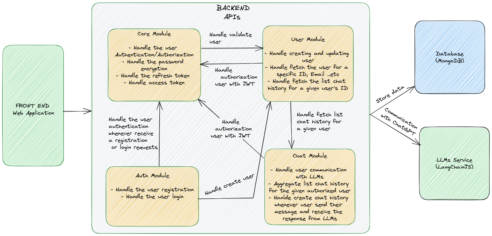

# Application Summary

- [Introduction](#introduction)
- [Architecture Diagram](#architecture-diagram)
- [General](#general)
- [Sources](#sources)
- [What's Done?](#whats-done)
- [What's Remain?](#whats-remain)
- [Technical Proposal](#technical-proposal)


## Introduction
Summary of the application

## Architecture Diagram




## General

The basic architecture is like this.

```bash
  /dist # Compiled runtime files (not committed to git)
  /src # Source code
  /test # Test utilities
    /integration # The folder holds all the integration tests
    /unit # The folder holds all the unit tests
```


## Sources

The `/src` directory is by convention defined in such a way.
```bash
/src
  /modules
    /module-name # Business logic functions that are shared between different endpoints.
        /`{fileName}.controller.ts` # Controller where declare all the endpoints logic of the module
        /`{fileName}.service.ts` # Service where declare all the business logic handlers and actions as a bridge to connect between Service and Database
        /`{fileName}.module.ts` # NestJS module where provides, imports and exports the entities, controllers, services, repositories needed
        /schema # Holds all the information related to Database models that's represent for the module
        /repository # Declare the repository for given module where coordinates with the database model
        /utils # Utility functions for the module
        /dtos # Declare the validation for the specific endpoints
  /consts # Project-wide constants or enumerations
  /utils
    # Utility functions
  /`app.module.ts` # The application module where imports all the project's modules
  /`main.ts` # File containing bootstrapping functions for NestJs application
```

On larger projects, the architecture can be divided in smaller sub-modules that have a separate business logic.

```bash
/src
  /modules
      /contact
        /`contact.controller.ts`
        /`contact.service.ts`
        /`contact.module.ts`
        /repository
            /interface
              `contact.repository.interface.ts`
            `contact.repository.ts`
        /schema
           `contact.schema.ts`   
        /utils
          `contact.utils.ts`
        /dtos
          `contact.dto.ts`      
      /user
        /`user.controller.ts`
        /`user.service.ts`
        /`user.module.ts`
        /repository
            interface
              `user.repository.interface.ts`
            `user.repository.ts`
        /schema
          `user.schema.ts`   
        /utils
          `user.utils.ts` 
        /dtos
          `user.dto.ts`         
  /utils
    `{fileName}.util.ts`
  /consts
    `{fileName}.const.ts`  
  `app.module.ts`
  `main.ts`  
```

## What's Done?

- There are four essential APIs have been implemented that allow users registration, login, and communicate with ChatGPT along with fetching their chat history.
- Those APIs are:
    + [Login](https://github.com/phatvo21/chat-gpt-app#post---apiv1publicauthlogin)
    + [Registration](https://github.com/phatvo21/chat-gpt-app#post---apiv1publicauthregistration)
    + [Chat](https://github.com/phatvo21/chat-gpt-app#post---apiv1chat)
    + [Chat History](https://github.com/phatvo21/chat-gpt-app#get---apiv1userschat-history)
- MongoDB has been initialized to allow store and fetching of the data (This database offers scalability as it uses JSON-like)
- Integrated LangChainJS that allows user send the message to LLMs
- Integrated fully unit and integration tests for all features and functionalities
- Docker environment is provided for flexibility
- CI has been configured with GitHub Actions
- Application installation and technical specifications have provided in [README.md](../README.md)
- There is a useful library situated in the `libs/common` folder. This library ships with a lot of features to standardize the creation of services, letting you focus on business logic. We can consider publishing this library via an npm package. 

## What's Remain?

- There are still six APIs mentioned in the Technical Specification that need to implement. Without those six APIs, the authenticated users still communicate with ChatGPT via the application. As it is not a high priority for now, we would need to implement all those six APIs that enable better user experiences.
- Those APIs are:
  + [Resend Email](https://github.com/phatvo21/chat-gpt-app#post---apiv1publicauthresend-email)
  + [Verify Email](https://github.com/phatvo21/chat-gpt-app#post---apiv1publicauthverify-email)
  + [Forgot Password](https://github.com/phatvo21/chat-gpt-app#post---apiv1publicauthforgot-password)
  + [Reset Password](https://github.com/phatvo21/chat-gpt-app#post---apiv1publicauthreset-password)
  + [Refresh Token](https://github.com/phatvo21/chat-gpt-app#post---apiv1publicauthrefresh)
  + [Change Password](https://github.com/phatvo21/chat-gpt-app#patch---apiv1change-password)
- An email service needs to be integrated that allows sending some emails like verification emails to the users ...etc.
- Redis service needs to be integrated that allows some necessary data like resetting password keys where those keys don't need to store in the database for the application performance purpose.
- Fake tokens need to be handled as we don't enable to empower let the users know if they trying to register an existing email in the system. Then the fake tokens should be returned.  

## Technical Proposal
- Integrate a message queue like Rabbitmq that allows asynchronous sending events. The purpose of this is to handle sending emails. For example: An event will be published whenever the user registers a new account and somewhere in the application can subscribe to that event to handle sending a verification email to that user. 
- Integrate a search and analytics service that allows the user search their chat history in an efficient and fast way. Elasticsearch could be the best choice for this purpose.